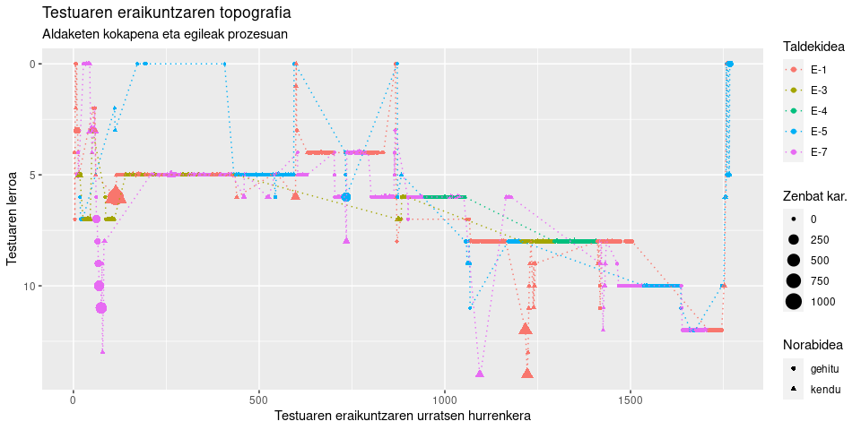

<!-- README.md is generated from README.Rmd. Please edit that file -->

# IDAT 

<!-- badges: start -->

[](https://lifecycle.r-lib.org/articles/stages.html#experimental)
<!-- badges: end -->

IDAT (*Idazketan Aztertzeko Tresna*) erabil daiteke idazkuntza prozesua
aztertzeko, [Etherpad](https://etherpad.org/) instantzia batean
idatzitakoa aztertu eta analizatzeko.

`.etherpad` fitxategiko datuak antolatzeko balio du, horien informazioa
aztertzeko.

## Instalatzea

IDAT paketea GitLabeko [biltegi](https://gitlab.com/JuanAbasolo/idat)tik
jaitsita instala dezakezu.

``` r
remotes::install_gitlab('JuanAbasolo/idat')
```

## Adibidea

Oinarrizko erabileraren adibidea.

``` r
library(IDAT)
kokapena <- "inst/extdata/"
fitxategia <- "txepetx-2-lo1uvq90o.etherpad"
o_idat <- f_IDAT(kokapena, fitxategia)
```

Laburpena

``` r
summary(o_idat)
#>              Length Class  Mode     
#> pad           1     -none- character
#> testua        1     -none- character
#> df_aldaketak 21     tbl_df list     
#> df_egileak    6     tbl_df list     
#> df_pool       4     tbl_df list     
#> ni            1     -none- character
```

Elementuak hauek dira:

- `pad`, bat luzerako karaktere bektorea, prozesatu den fitategiaren
  izena
- `testua`, bat luzerako karaktere bektorea, testuaren azken bertsioa.
- `df_aldaketak`, `tibble`/`data.frame` erako objektua. Testuaren
  eraikitze prozesuko erregistroen hurrenkera, hogei aldagaitan azaldua.
- `df_egileak`, `tibble`/`data.frame` erako objektua, egileak
  identifikatzeko sei aldagai dituena.
- `df_pool`, `tibble`/`data.frame` erako objektua, testuari ezarritako
  formatuak identifikatzeko balio duena.
- `ni`, ezabatzea komeni daitekeen erabiltzaile baten `author` kodea.

Prozesuaren inguruko informazioa `df_aldaketak` objektuan dago

## Informazioa garbitu

Baliteke `.etherpad` fitxategiak duen hainbat informazio ez izatea
esanguratsua. Esate baterako instantziak berak aurrez fitxategian
eskaintzen duena edo ikertzaileak, irakasleak edo dena delakoak gehitua;
informazio hori ezabatzeko `f_garbitu` erabil daiteke.

``` r
require(dplyr) |> suppressMessages()
o_idat$df_aldaketak |>
  summarise(
    egile_kopurua = unique(author) |> length(),
    pausu_kopurua = n()
  )
#> # A tibble: 1 × 2
#>   egile_kopurua pausu_kopurua
#>           <int>         <int>
#> 1             7          1771

o_idat$df_aldaketak |>
  f_garbitu() |>
  summarise(
    egile_kopurua = unique(author) |> length(),
    pausu_kopurua = n()
  )
#> # A tibble: 1 × 2
#>   egile_kopurua pausu_kopurua
#>           <int>         <int>
#> 1             5          1766
```

## Egileak anonimo egin edo berrizendatu

`.etherpad` fitxategiak gorde dezake egileak bere buruari emandako
izena, baldin eta eman badu. Egileak emandako izen horien arabera
identifikatu daitezke edo anonimotasunean landu ere bai. Horretarako
f_IDentifikau funtzioa erabili behar da

``` r
o_idat$df_aldaketak |>
  group_by(name) |>
  summarise(aldaketa_kopurua = n())
#> # A tibble: 7 × 2
#>   name                 aldaketa_kopurua
#>   <fct>                           <int>
#> 1 "Ainara Herrero"                  434
#> 2 "Graciela Hernández"              206
#> 3 "MaisuJuan"                         2
#> 4 "Maria Abadia"                    579
#> 5 "Sorkunde Valle "                 342
#> 6 "Xabier Paez"                     205
#> 7  <NA>                               3

o_idat$df_aldaketak |>
  f_IDentifikau(anonimu = TRUE) |>
  group_by(egileak) |>
  summarise(aldaketa_kopurua = n())
#> # A tibble: 7 × 2
#>   egileak aldaketa_kopurua
#>   <fct>              <int>
#> 1 E-1                    2
#> 2 E-2                  205
#> 3 E-3                  206
#> 4 E-4                  342
#> 5 E-5                  579
#> 6 E-6                    3
#> 7 E-7                  434
```

## Idazkuntza prozesuko testua eta etiketatzea

Egile bakoitzak ekarritako testuak ere azter daitezke hainbat elementu
nabarmenduta:

- Ea zein lerrotan idatzi duen, `●3.Ln:` kodeaz
- Ea zenbateko etenak egin dituen idaztalditik idaztaldira `<2.8seg>`
  erako kodeaz.
- Ea zenbat ezabatu duen, `[←19]` moduko kodeaz.
- Ea paragrafoan / lerroan hurrengo kokapenean idazten duen ala jauziak
  egin dituen bertan barruan, honelako kodeaz: `[68↶][19↷]`.
- Ea testua beste nonbaitetik hartu eta itsatsia den, honako kodeen
  artean markatuta `]■C+P⇒::` eta `::⇐C+P■`.

Horiek denak banan banan zein denak batera eska daitezke `f_idatzia`
funtzioa erabiliaz.

``` r
library(stringr) |> suppressMessages()
f_idatzia(o_idat$df_aldaketak,
  lerru = TRUE,
  etenak = TRUE, dm = 2000,
  ezabatuak = TRUE, copypaste = TRUE,
  lerroko_jauziak = TRUE
) |> # suppressWarnings() |>
  filter(egileak == levels(egileak)[3]) |>
  select(idatzia) |>
  unlist() |>
  unname() |>
  paste(collapse = "") |>
  str_replace_all("\n\n\n", "\n\n") |>
  cat()
#> Warning in f_idatzia(o_idat$df_aldaketak, lerru = TRUE, etenak = TRUE, dm = 2000, : 
#> Lerro arteko jauzietan eta lerro barrukoetan 26 datu galdu egon dira; beraz, horrenbeste marka falta daitekez
#> Warning in f_idatzia(o_idat$df_aldaketak, lerru = TRUE, etenak = TRUE, dm = 2000, : Etenenen marketan ere, 7 datu falta dira; beraz, horrenbeste eten markatzeke egon daitekez
```

?●Ln:?::\[←32\]\<3.1seg\>\[32↷\]■C+P⇒::233zbk/artikuluak/34323330.pdf
↩::⇐C+P■

●7Ln:2⇓::\<9m.20seg\>\[39↶\]a■C+P⇒::bxklbawsdxk::⇐C+P■
bs\[←1\]\[←1\]\[←6\]\[5↶\]\[←3\]\[←3\]\<2.8seg\>\[←19\]\[390↷\]

●3.Ln:4⇑::\<4m.42seg\>\[137↶\]■C+P⇒::<https://ojs.ehu.eus/index.php/ASJU/index>::⇐C+P■
\[250↶\]

●6Ln:3⇓::\<22m.32seg\>\[82↷\]

●7Ln:1⇓::\<2.1seg\>\[581↷\]E\[705↶\]AE \[←1\]\[←1\]n
\<6.3seg\>d■C+P⇒::agoen ego era ::⇐C+P■
erreparat\[←1\]\[←6\]\[5↶\]\[←6\]\[←6\]\[←6\]\[←3\]\<2.3seg\>
\[←1\]\[←1\]\[705↷\]

●5.Ln:2⇑::\<6m.9seg\>\[673↶\]h\<3.6seg\>\[←1\]\[←1\]zkuntza\[9↶\]■C+P⇒::Hizkuntzaren
::⇐C+P■ \[9↷\]od\[←1\]fizial ditugu\<3.1seg\>\[←1\]\[28↶\]
hizkuntza\[9↶\]■C+P⇒::Hizkuntzaren od::⇐C+P■ \[9↷\]i\<12seg\>\[7↶\]
\<7seg\> \<2.6seg\>ofizial
i\<2.6seg\>ka\[←3\]\<15.2seg\>\[←8\]\[21↷\]\[←1\]\[7↷\]\<2.2seg\>\[25↶\]
ofizial\<2m.16seg\>\[←1\]\[54↷\]\[←3\]\[←3\]\[←2\]\[←1\]ikastetxeetan bu
\[←1\]\[←1\]i\<3seg\>\[←1\]\[7↶\]\<3.4seg\>\[7↷\]
hi\[←1\]\[←1\]\<35seg\>\[←1\]\[26↷\]\[←2\]\<1m.55seg\>\[23↶\]

●7Ln:2⇓::\<1156m.17seg\>\[←19\]\[68↶\]\[19↷\]ofizial \<4.9seg\>nag

●6.Ln:1⇑::ysi\[←1\]\[←2\]udi\[←2\]si dira\<4.8seg\>\[←1\],
\<4.8seg\>\[33↷\] ere

●8Ln:2⇓::\<4m.38seg\>\[121↷\]Lehenik eta behin, \<5.2seg\>kontuan
hartz\[←1\]zekoa dugu egoera, \<4.5seg\>ahoz eta idatzz\[←1\]\[←1\]ziz
\<5.1seg\>ematen ari den. \<3.7seg\>behin\[←2\]\[←3\]Behin horia
ikui\[←1\]sita, \<5.5seg\>egoera \<8seg\>modu informalean
\<4.3seg\>ematen den

## Irudiak sortzea

Berez, irudiak sortzeko ez da programazio berezirik IDATen, `ggplot2`eta
beste erabil daiteke horren informazioaren irudiak aztertzeko.

Hurrengoa talde lan baten irudia da.

``` r
require(ggplot2) |> suppressMessages()
o_idat$df_aldaketak |>
  f_garbitu() |>
  f_IDentifikau(anonimu = T) |>
  mutate(norabidea = ifelse(azktex == "<", "kendu", "gehitu")) |>
  ggplot(aes(x = revs, y = kok_lerru, color = egileak)) +
  geom_point(aes(size = newLen, shape = norabidea)) +
  geom_line(lty = 3) +
  scale_y_reverse() +
  labs(
    title = "Testuaren eraikuntzaren topografia",
    subtitle = "Aldaketen kokapena eta egileak prozesuan",
    y = "Testuaren lerroa",
    x = "Testuaren eraikuntzaren urratsen hurrenkera",
    color = "Taldekidea",
    size = "Zenbat kar.",
    shape = "Norabidea"
  )
```

<div class="figure">


<p class="caption">
Talde lan ez onegi baten topografia
</p>

</div>

------------------------------------------------------------------------

Argitaratzeko prozesuan.

Zalantzak edo oharrak zuzenean niri korreoz, arren: *juan* puntu
*abasolo* abildua *ehu* puntu *eus*
